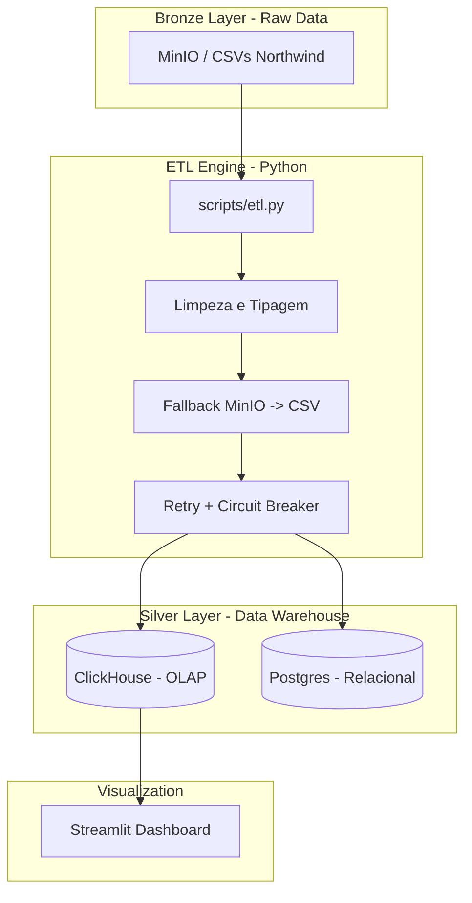
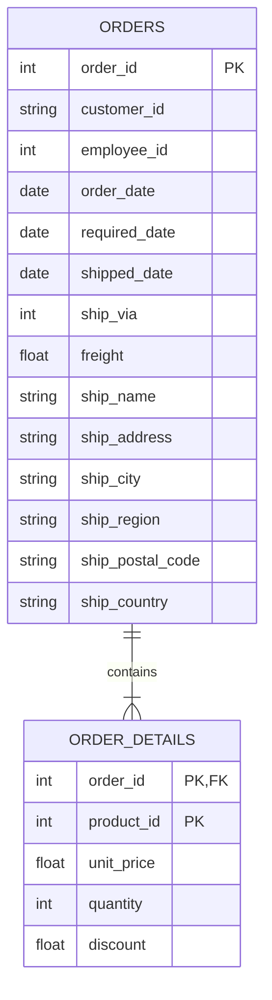

# 20261sre-projeto-final — Northwind ETL Platform

Este repositório contém a entrega final para a disciplina **Cloud Computing e SRE — Visão Prática com AWS**. O projeto implementa um pipeline de dados ponta a ponta para o dataset Northwind, aplicando táticas arquiteturais para garantir resiliência, idempotência, observabilidade e testabilidade.

## 1. Objeto do Projeto
O objetivo deste projeto é construir uma plataforma de dados robusta para processar e analisar pedidos do ecossistema Northwind (distribuição de alimentos). O sistema realiza a ingestão de pedidos (`orders`) e itens de pedidos (`order_details`), transforma os dados brutos para um formato analítico e disponibiliza métricas de negócio via dashboard interativo.

## 2. Arquitetura Adotada
A arquitetura segue o princípio de desacoplamento e camadas (Bronze/Silver). A camada Bronze é atendida por MinIO como landing zone e, quando necessário, o ETL realiza fallback automático para os CSVs locais em `spec/arquivos_csv_northwind`, garantindo continuidade operacional mesmo com indisponibilidade do storage.

### Diagrama de Arquitetura


### Justificativas Técnicas:
*   **MinIO + fallback local:** O ETL tenta ler os arquivos do MinIO primeiro e, se a leitura falhar, usa automaticamente os CSVs locais para manter a ingestão disponível.
*   **ClickHouse:** Escolhido como motor analítico principal devido à sua engine colunar vetorizada, permitindo agregações ultra-rápidas para o dashboard.
*   **Postgres:** Mantido como cópia relacional para garantir compatibilidade com sistemas legados e integridade referencial estrita.
*   **Python (Pandas):** Utilizado para a orquestração do ETL por sua flexibilidade em manipulação de tipos e tratamento de valores nulos.
*   **CircuitBreaker + Retry:** As cargas em Postgres e ClickHouse combinam `tenacity` com `CircuitBreaker` para tolerar falhas transitórias sem ocultar falhas persistentes.

## 3. Modelagem de Dados
O projeto utiliza o dataset Northwind, focado no relacionamento entre pedidos e seus itens.

### Modelo Lógico (ER)


## 4. Táticas Arquiteturais Aplicadas (Bass & ATAM)

| Tática | Categoria | Implementação | Cenário ATAM Endereçado |
| :--- | :--- | :--- | :--- |
| **Idempotência** | Disponibilidade | Uso de `ReplacingMergeTree` no ClickHouse e `UPSERT` no Postgres. | Re-execução do pipeline após falha parcial sem duplicar registros. |
| **Performance OLAP** | Desempenho | Armazenamento colunar no ClickHouse para o Dashboard. | Garantir latência < 2s em queries de agregação sobre grandes volumes. |
| **Healthchecks** | Disponibilidade | `depends_on: condition: service_healthy` no Docker Compose. | Evitar race conditions no startup dos containers. |
| **Fallback de Ingestão** | Resiliência | Pivoteamento dinâmico para MinIO e, em falha, leitura automática dos CSVs locais. | Manter a operação do pipeline mesmo com indisponibilidade de serviços de storage. |

### Documento ATAM Completo

A análise completa dos atributos de qualidade da Aula 05 está consolidada em [documents/atam.md](documents/atam.md), com cobertura dos atributos Availability, Performance, Modifiability, Security, Deployability, Cost e Testability.

## 5. Quick Start (Execução Local)

O ambiente é totalmente orquestrado via Docker, garantindo que a stack esteja `up & running` em menos de 15 minutos.

### Pré-requisitos:
*   Docker e Docker Compose instalados.
*   Python 3.11+.

### Passo 1: Subir a Infraestrutura
```bash
docker-compose up -d
```

### Passo 2: Configurar o Banco de Dados
```bash
pip install clickhouse-connect psycopg2-binary pandas
python3 scripts/db_setup.py
```

Se você quiser testar a origem remota do Bronze Layer, publique os CSVs no bucket do MinIO configurado no compose. Caso contrário, o ETL usa automaticamente os arquivos locais de `spec/arquivos_csv_northwind`.

### Passo 3: Executar o Pipeline ETL
```bash
python3 scripts/etl.py
```

### Passo 4: Acessar o Dashboard
Abra o navegador em: [http://localhost:8501](http://localhost:8501)

## 6. Verificação e Validação

### Testes Automatizados
A suíte completa de testes pytest cobre o `CircuitBreaker`, o fallback de ingestão e o pipeline de carga em Postgres/ClickHouse, com cobertura acima de 85%. Para rodar manualmente:
```bash
python -m pytest tests/ -v --tb=short
```

Os testes estão organizados em `tests/unit/` e `tests/integration/`, com `tests/conftest.py` para preparar os imports do projeto e isolar os cenários de execução.

### Verificação dos Dados
Você pode validar a carga diretamente no ClickHouse:
```bash
# Acessar via HTTP Play interface: http://localhost:8123/play
SELECT count() FROM northwind.orders;
```

## 7. Trade-offs e Aprendizados
1.  **Batch vs Streaming:** Optamos por processamento em lote (micro-batch) via Python. Para o volume do Northwind (~100k/dia), a complexidade de um Kafka/Flink não se justificaria (Overengineering).
2.  **Schema-on-Write:** Diferente da Aula 04 (Olist), aplicamos schema estrito na carga (Silver Layer) para garantir que o dashboard Streamlit nunca encontre dados malformados.
3.  **Dívida Técnica:** Atualmente, a limpeza de dados é feita em memória (Pandas). Para volumes na escala de TB, precisaríamos migrar essa lógica para dentro do ClickHouse via `Buffer Tables`.

## 8. Entregáveis da Aula 05

Os principais entregáveis desta etapa estão consolidados abaixo:

*   **MinIO + Fallback:** o ETL tenta ler os CSVs do MinIO e, em caso de indisponibilidade, faz fallback automático para `spec/arquivos_csv_northwind`.
*   **Suíte completa de testes pytest:** testes unitários e de integração organizados em `tests/unit/` e `tests/integration/`, com `conftest.py` para apoio de importações e execução.
*   **Tabela ATAM:** análise consolidada em [documents/atam.md](documents/atam.md), cobrindo os 7 atributos de qualidade da Aula 05.
*   **Circuit Breaker + Retry + Healthchecks:** proteção contra falhas transitórias nas cargas, com `tenacity`, `CircuitBreaker` e healthchecks nos serviços do Docker Compose.
*   **Como rodar o projeto completo:**
    1. `docker-compose up -d`
    2. `python3 scripts/db_setup.py`
    3. `python3 scripts/etl.py`
    4. `python -m pytest tests/ -v --tb=short`

Para a revisão final da entrega, o foco principal é garantir que a stack suba com saúde, o fallback MinIO funcione e a suíte de testes seja executada com sucesso no ambiente local.

---
**Desenvolvido por:** Gabriel Silva
**Turma:** 2026/1 - MBA Engenharia de Dados
